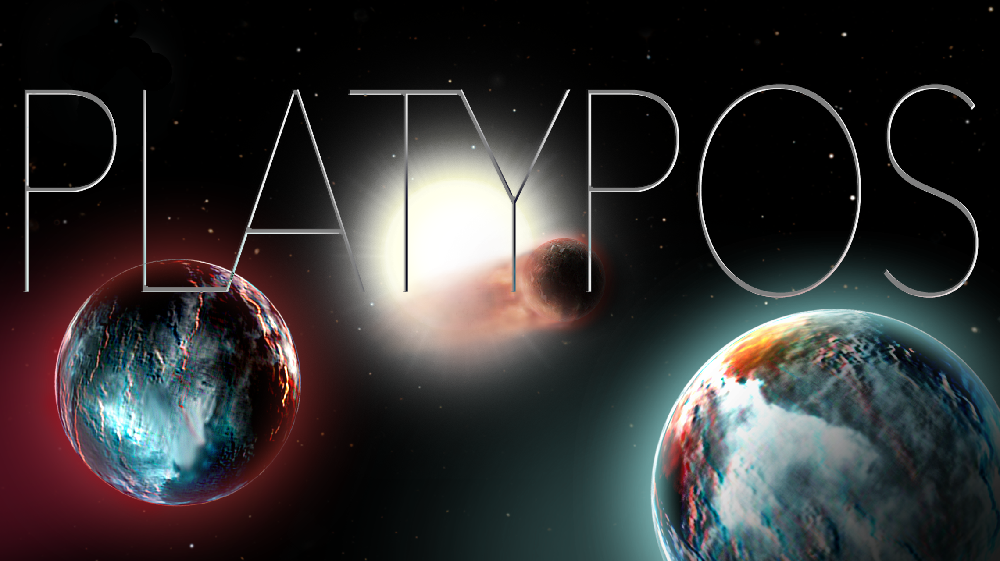

# PLATYPOS - PLAneTarY PhOtoevaporation Simulator
Tool to estimate the atmospheric mass loss of planets induced by the stellar X-ray and extreme UV irradiance. 

## Our Model Assumptions
We do not make use of full-blown hydrodynamical simulations, but instead couple existing parametrizations of planetary mass-radius relations with an energy-limited hydrodynamic escape model to estimate the mass-loss rate over time.

### Mass-loss description:   

where 

is the flux impinging on the planet, 

and 

are the planetary radii at optical and XUV wavelengths, respectively (
).

is the mass and 

the density of the planet, 

is the efficiency of the atmospheric escape with a value between 0 and 1, and K is a factor representing the impact of Roche lobe overflow (Erkaev et al. 2007)[^Erkaev-et-al-07], which can take on values of 1 for no Roche lobe influence and <1 for planets filling significant fractions of their Roche lobes.

**Stellar high-energy evolution**   
Most previous studies of exoplanet evaporation approximate the stellar XUV evolution by using the average activity level of stars in a specific mass bin for well-studied clusters of different ages, and approximating it with a broken power-law with a 100 Myr-long saturation regime. Observations and theoretical studies show, however, that stars spin down at a wider range of ages (see Barnes 2003[^Barnes-03], Matt et al. 2012[^Matt-et-al-12], Tu et al. 2015[^Tu-et-al-15], Garaffo et al. 2018[^Garaffo-et-al-2018]). In the context of exoplanet irradiation, this was explored in simulations by Tu et al. (2015)[^Tu-et-al-15] and Johnstone et al. (2015)[^Johnstone-et-al-2015]. Their studies show that the saturation timescales can range from ~10 to 300 Myr for solar-mass stars. Hence, a star that spins down quickly will follow a low-activity track, while a star that can maintain its rapid rotation will follow a high-activity track. This translates into significantly different irradiation levels for exoplanets, and thus the amount and strength of evaporation. Based on the findings by Tu et al. (2015), we generate a more realistic stellar activity evolution of the host star by adopting a broken power-law model with varying saturation and spin-down time scales to approximate a low-, medium- and high-activity scenario for the host star.

### Planet Model description:  
At the moment, the user can choose between two planet models.

1. *Planet with a rocky core and H/He envelope atop*  
We use the tabulated models of Lopez & Fortney (2014)[^Lopez-Fortney-14], who calculate radii for low-mass planets with hydrogen-helium envelopes on top of Earth-like rocky cores, taking into account the cooling and thermal contraction of the atmospheres of such planets over time. Their simulations extend to young planetary ages, at which planets are expected to still be warm and possibly inflated. Simple analytical fits to their simulation results are provided, which we use to trace the thermal and photoevaporative evolution of the planetary radius over time.

1. *Planet which follows the empirical mass-radius relationships observed for planets around older stars*   
(see Otegi et al. (2020)[^Otegi-et-al-2020], also Chen & Kipping (2017)[^Chen-Kipping-2017])  
These "mature" relationships show two regimes, one for small rocky planets up to radii of about 2 Earth radii and one for larger planets with volatile-rich envelopes. The scatter is low in the rocky planet regime and larger in the gaseous planet regime: as core vs. envelope fractions may vary, there is a broader range of observed masses at a given planetary radius for those larger planets. 

1. *Giant planets with mass-radius relations computed using MESA*  
To be implemented...

## Repository Structure:

* **platypos_package**: contains the planet classes & all the necessary funtions to construct a planet and make it evolve 
                        (LoF014 planet with rocky core & gaseous envelope OR planet based on mass-radius relation for mature planets (Ot20))

* **supplementary_files**: contains some extra files for plotting; 
                           Tu et al. (2015)[^Tu-et-al-15] model tracks for the X-ray luminosity evolution, 
                           Jackson et al. (2012)[^Jackson-et-al-12] sample of X-ray measurements in young clusters)

* **example_V1298Tau**: evolve the four young V1298 Tau planets as shown in "X-ray irradiation and evaporation of the four young planets around V1298 Tau" 
			(Poppenhaeger, Ketzer, Mallon 2020)[^Poppenhaeger-et-al-20]

* **population_evolution**: evolve a whole population of planets (to be fully implemented in the future)

## References:

[^Poppenhaeger-et-al-20]: [Poppenhaeger, Ketzer, Mallon 2020](https://arxiv.org/abs/2005.10240)
[^Erkaev-et-al-07]: [Erkaev et al. 2007](https://arxiv.org/abs/astro-ph/0612729)
[^Lopez-Fortney-14]: [Lopez & Fortney 2014](https://arxiv.org/abs/1311.0329)
[^Jackson-et-al-12]: [Jackson et al. 2012](https://arxiv.org/abs/1111.0031)
[^Chen-Kipping-2017]: [Chen & Kipping 2017](https://arxiv.org/abs/1603.08614)
[^Otegi-et-al-2020]: [Otegi et al. 2020](https://arxiv.org/abs/1911.04745)
[^Barnes-03]: [Barnes 2003](https://arxiv.org/abs/astro-ph/0303631)
[^Matt-et-al-12]: [Matt et al. 2012](https://arxiv.org/abs/1206.2354)
[^Tu-et-al-15]: [Tu et al. 2015](https://arxiv.org/abs/2005.10240)
[^Johnstone-et-al-2015]: [Johnstone et al. 2015](https://arxiv.org/abs/1503.07494)
[^Garaffo-et-al-2018]: [Garaffo et al. 2018](https://arxiv.org/abs/1804.01986)
